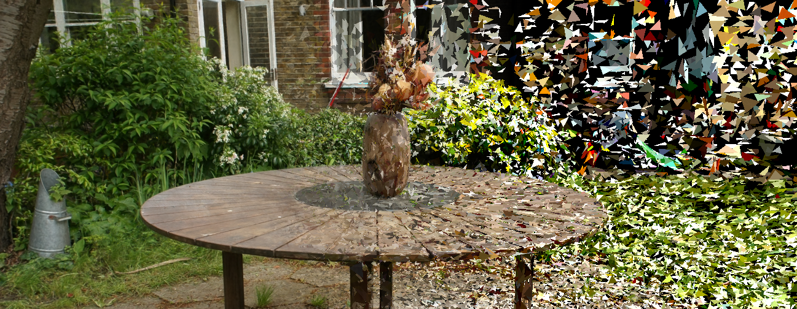

<h1 align="center">Triangle Splatting for Real-Time Radiance Field Rendering</h1>

<div align="center">
  <a href="https://trianglesplatting.github.io/">Project page</a> &nbsp;|&nbsp;
  <a href="https://arxiv.org/abs/2505.19175">Arxiv</a> &nbsp;|&nbsp;
</div>
<br>

<p align="center">
  Jan Held*, Renaud Vandeghen, Adrien Deliege, Abdullah Hamdi, Silvio Giancola, Anthony Cioppa, Andrea Vedaldi, Bernard Ghanem, Andrea Tagliasacchi, Marc Van Droogenbroeck
</p>

<br>

<div align="center">
  
</div>


This repo contains the official implementation for the paper "Triangle Splatting for Real-Time Radiance Field Rendering". 

Our work represents a significant advancement in radiance field rendering by introducing 3D triangles as rendering primitive. By leveraging the same primitive used in classical mesh representations, our method bridges the gap between neural rendering and traditional graphics pipelines. Triangle Splatting offers a compelling alternative to volumetric and implicit methods, achieving high visual fidelity with faster rendering performance. These results establish Triangle Splatting as a promising step toward mesh-aware neural rendering, unifying decades of GPU-accelerated graphics with modern differentiable frameworks.

<p align="center">
  🚨 <strong>Code will be released soon</strong> 🚨
</p>

## BibTeX
```bibtex
@article{Held2025Triangle,
title = {Triangle Splatting for Real-Time Radiance Field Rendering},
author = {Held, Jan and Vandeghen, Renaud and Deliege, Adrien and Hamdi, Abdullah and Cioppa, Anthony and Giancola, Silvio and Vedaldi, Andrea and Ghanem, Bernard and Tagliasacchi, Andrea and Van Droogenbroeck, Marc},
journal = {arXiv},
year = {2025},
}
```
